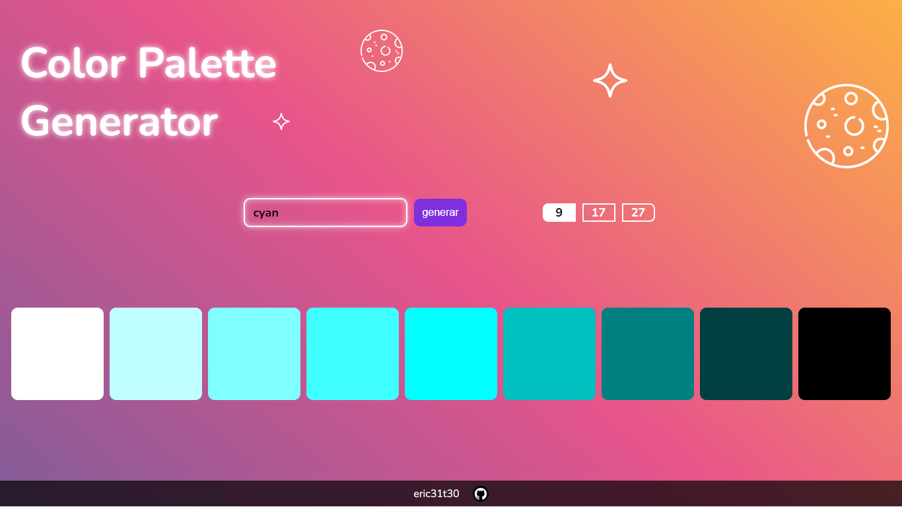

# Color-generator

Una aplicación sencilla en React, impulsada por Vite, que genera colores aleatorios. Los usuarios pueden generar y visualizar fácilmente diferentes colores.

## Características

- Generar colores introducidos por el usuario y mostrando variaciones de este.
- Ver códigos de colores en formato HEX.
- Interfaz fácil de usar.
- permite copiar el codigo HEX de los colores.
- permite elegir cierta cantidad de colores a mostrar.

## Instrucciones de Uso

1. use la barra para generar el color que desea.
2. usa los botones a su derecha para elegir la cantidad de colores a mostrar.
3. puede hacer clic en los colores para copiar su codigo HEX.

## Tecnologías Utilizadas

- React y css para la estructura, diseño y funcionalidad del Color-generator.
- uso de la libreria values.js para la obtencion de colores.

Puedes ver la demostración con **GitHub Pages**.

	

